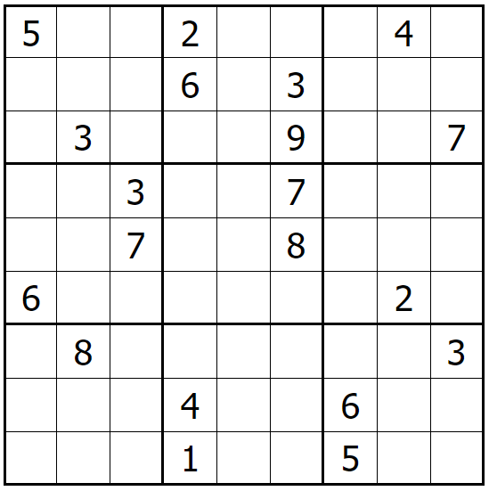
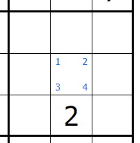
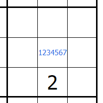
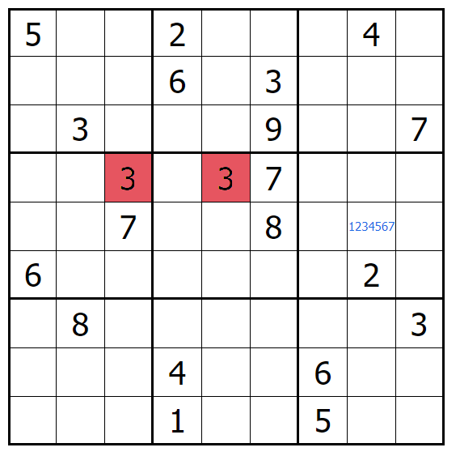
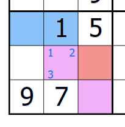
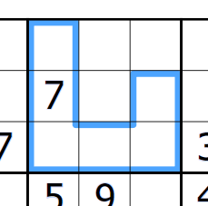
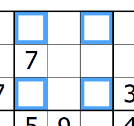

# Projet de synthèse
## Été 2025

Le projet que vous aurez à réaliser durant le cours de cette session est un outil permettant de résoudre des grilles Sudoku. L'objectif est de vous faire implémenter un logiciel avec différents composants qui interagissent essemble, tout en conservant une conceptualisation claire et efficace.

Vous n'avez pas besoin d'être capable de résoudre des Sudoku vous même pour compléter ce travail. Cependant, la page Wikipédia sur le sujet peut vous être utile pour comprendre de quoi il s'agit: [https://fr.wikipedia.org/wiki/Sudoku](https://fr.wikipedia.org/wiki/Sudoku).

## Spécifications générales

Voici les grandes lignes de ce que votre application devra contenir :

* Une interface graphique d'une grille 9x9 où l'ont peut insérer des chiffres à différents endroits.
* Un système qui vérifie si l'état actuel Sudoku est valide ou non.
* Une fonctionnalité de sauvegarde et chargement d'une grille.
* Une fonctionnalité _undo-redo_.
* Permettre d'ajouter une couleur différente à chaque case parmi 9 couleurs fournies.
* Permettre d'effectuer des changements sur plusieurs cases à la fois.
* Votre code devra faire usage de trois (3) patrons de conceptions GoF différents, tels que vu dans le cours de Génie Logiciel.
* Une batterie de test unitaires automatisés qui vérifie chaque fonctionnalité.

De plus, vous devrez fournir un rapport contenant les informations suivantes :

* Cinq exemples dans votre code qui démontrent l'application de chacun des 5 principes SOLID.
* Trois exemples dans votre code qui démontrent l'application de chacun un principe GRASP différent.
* Chaque exemple doit être accompagné d'explications et justifications.

Finalement, vous devrez me présenter votre programme fonctionnel à la fin de la session. Les présentations seront faites de façon indivuelle au laboratoire. Vous aurez chacun une plage de 15 minutes pour me présenter votre programme.

## Spécifications détaillées

Suit les détails des spécifications qui vont être vérifiés lors de la correction.

### Techonologies

Ce travail doit être complété en utilisant le langage de programmation C#. Vous pourrez utiliser le Framework de développement d'interface graphique de votre choix (WPF, WinForms, ASP .NET, Unity, etc.).

### Code source

Peu importe les technologies choisies, votre code source, ainsi que votre rapport, devra se retrouver dans le dépôt Git prévu pour ce travail. Il n'est pas nécessaire d'inclure l'exécutable dans le dépôt.

### Interface graphique

Votre application doit avoir une interface graphique. Cet interface devra représenter une grille Sudoku 9 x 9 où l'ont peut entrer des chiffres de 1 à 9 :

La grille doit être visiblement séparée en 9 boîtes de 3 x 3 (voir image ci-dessus).

De plus, votre interface devra supporter deux types de notations spéciales :

* On peut entrer des chiffres (au moins 4 différents) dans les coins des cases :

* On peut entrer des chiffres au centre des cases :

* Dans toutes les situations, il est impossible d'entrer plus d'une fois le même chiffre dans une case.

Votre interface graphique devra être conviviale et facile d'utilisation, avec une manière claire et rapide de changer le mode de notation.

### Vérification de l'état de la grille

Vous devrez avoir une fonctionnalité dans votre application qui vérifie si une erreur est présente dans la grille en tout temps. Ici, on parle d'une erreur quand un même chiffre se retrouve :

* Dans une même ligne, ou
* Dans une même colonne, ou
* Dans une même boîte 3x3.

L'erreur devra être signalée de façon visuelle et claire à l'utilisateur, sans être dérangeant (pas de boîte de dialogue qui s'affiche soudainement!).

### Sauvegarde et chargement

Votre application doit permettre à son utilisateur de sauvegarder une grille en cours dans un fichier et de charger une grille sauvegardée. Il n'y a pas de format particulier à respecter pour le fichier de sauvegarde.

### _Undo/Redo_

Vous devez offrir à l'utilisateur de votre programme la possibilité de revenir en arrière sur chacune des modifications qu'il effectue sur la grille. En d'autres termes, si l'utilisateur remplace un chiffre dans une case, il doit pouvoir faire un _undo_ pour revenir en arrière et remettre l'ancien chiffre. Ceci doit fonctionner pour tous les types de modifications possibles : chiffres finaux, notes en coin ou centre, couleurs.

De plus, vous devez aussi fournir une fonctionnalité _redo_ qui permet de défaire un ou plusieurs _undo_ fait de suite. Donc, si l'utilisateur utilise _undo_ 3 fois de suite, il peut ensuite faire _redo_ jusqu'à 3 fois pour remettre en place ses modifications. À noter que s'il effectue tout autre changement suite à un ou plusieurs _undo_, la fonctionnalité _redo_ devient inaccessible.

### Ajout de couleurs

En plus de contenir des chiffres, vos cases devront pouvoir contenir une couleur. L'utilisateur doit pouvoir colorer les cases individuellement avec une de neuf couleurs différentes de votre choix.

### Changements sur plusieurs cellules

Votre logiciel doit permettre à l'utilisateur de sélectionner plusieurs cellules à la fois, pour ensuite permettre d'effectuer un changement sur toutes ces cellules en même temps. Toutes les types de notations sont valides pour cette fonctionnalités (chiffres finaux, notations en coin ou centre, couleurs).

Portez attention à l'interaction entre cette fonctionnalité et le _undo_. Si l'utilisateur fait une modification sur plusieurs cellules en même temps et ensuite fait _undo_, toutes les cellules modifiées doivent être remise à leur état précédent.

La forme de la sélection ne doit pas être limitée :

Et peut contenir des cellules disjointes :

À vous de déterminer l'interface utilisateur à fournir pour cette fonctionnalité!

### Tests unitaires

Vous devrez réaliser une batterie de tests unitaires automatisés pour trois des fonctionnalités présentées ci-dessus, soit : 

* Vérification de l'état de la grille
* Sauvegarde et chargement
* _Undo/Redo_

Vos tests ne doivent avoir aucune dépendence sur le système (e.g. aucun test ne devrait tenter d'écrire ou de lire un fichier sur le disque). Vous n'avez pas à tester l'interface graphique.

### Rapport

Vous devez fournir un rapport qui contient les informations suivantes :

* Cinq (5) exemples dans votre code qui démontrent l'application de chacun des 5 principes SOLID.
* Trois (3) exemples dans votre code qui démontrent l'application de chacun un patron de conception GoF différent.
* Chaque exemple doit être accompagné d'explications et justifications.

Votre rapport devra *obligatoirement* être en format Markdown et être déposé à la racine de votre dépôt Git sous le nom README.md. De cette façon, je pourrai consulter votre rapport directement en allant sur la page de votre Git.

Pour un guide d'utilisation de Markdown sur Git, vous pouvez consulter la page suivante : [https://guides.github.com/features/mastering-markdown/](https://guides.github.com/features/mastering-markdown/)

Sinon, ce document est lui-même écrit en Markdown, alors vous pouvez le télécharger et le consulter comme guide.

## Présentations

Vous aurez deux présentations à faire au cours de cet été. La première aura lieu le 2 juillet où vous aurez l'occasion de me présenter ce que vous avez fait jusqu'à maintenant. Je pourrai vous donner des commentaires et répondre à vos questions à ce moment. Je n'évaluerai pas votre travail à ce moment, mais les commentaires que je donnerai feront partie de l'évaluation finale. La deuxième et dernière présentation aura lieu le 13 août, où vous démontrerez le fonctionnement complet de votre application. Il s'agira me montrer le bon fonctionnement de chacune des fonctionnalités présentées ci-haut. Chaque présentation sera d'une durée maximale de 30 minutes.

Je vous recommende d'amener un ordinateur portable pour présenter, mais vous pourrez présenter sur les ordinateurs du laboratoire sinon.

## Dépôt Git

Vous pouvez obtenir votre dépôt Git au lien suivant : [https://classroom.github.com/a/QmnyQB26](https://classroom.github.com/a/QmnyQB26).

## Remise des travaux

Votre code et rapport devront être déposés sur votre Git avant la date des présentations.

Bonne chance!

# Étude de cas

Cette section contient des détails concernant l'expérience scientifique dont ce travail fait partie, incluent les règles et modalités.

## Modalités

Chaque participant à l'expérience se verra attribué une groupe (Contrôle ou Traitement) de façon aléatoire. Chaque groupe aura un ensemble de règles supplémentaires à respecter dans leur code. Ces règles sont décrites plus bas dans cette section.

## Contrat

Chaque participant à l'expérience devra consentir aux éléments suivants :

* Vous me permettez d'utiliser le code source de votre projet de synthèse pour faire des analyses et d'en publier les résultats.
* Votre code source ne sera pas rendu public sans votre consentement.
* Vos informations personnelles (incluant votre nom) ne seront pas divulguées.

## Objectif de l'expérience

L'objet de cette expérience est de déterminer si la programmation orientée-objet à l'aide objets immuables a un impact significatif sur la qualité du code. Pour en arriver là, les participants seront divisés en deux groupes : un groupe développera leur projet en utilisant des pratiques classiques orientée objets, et l'autre groupe utilisera de l'orienté-objet avec objets immuables. À la fin de l'étude, vous aurez l'occasion d'émettre des commentaires si vous le voulez.

Une fois les projets développés, différentes analyses seront faites sur le code source de chaque projet pour comparer des métriques de complexité (taille du code, couplage, complexité, etc.). Vos commentaires seront aussi pris en compte. Si des conclusions peuvent être tirées de ces analyses, elles pourront par la suite être publiées dans un journal scientifique.

## Règles de développement

Ci-suit les règles que chaque groupe devra suivre pour développer leur application.

### Groupe de Contrôle

Le groupe de contrôle développera leur projet en utilisant la méthodologie orientée objet classique. En plus des concepts vus dans les notes de cours qui doivent être inclus dans votre projet, votre code devra respecter les règles suivantes :

* Évitez de créer des objets inutilement. Réutiliser les objets existants lorsque possible (dans la mesure du raisonabble).
* Lorsqu'utile, vos objets peuvent avoir des méthodes qui changent leur état (e.g. setters).
* Respectez les règles d'encapsulation : vos attributs doivent être privés. Utilisez des getters setters (ou propriétés si supportées par le langage) pour accéder et modifier vos objets.

### Groupe de Traitement

Le groupe de traitement développera leur projet en n'utilisant que des objets immuables. En plus des concepts orientés-objet vus dans les notes de cours qui doivent être inclus dans votre projet, votre code devra respecter les règles suivantes :

* Tous les attributs de vos objets sont read-only. Si vous devez modifier un objet, créez-en un nouveau à la place.
* Vos méthodes "setters" doivent retourner un nouvel objet plutôt que modifier l'objet existant (voir TP1).
* Votre code peut se fier au fait que l'état d'un objet ne changera jamais.
* Respectez tout de même les règles d'encapsulation : vos attributs doivent être privés. Utiliser des getters (ou propriétés read-only si supportées par le langage) pour accéder aux attributs de vos objets.
* Les classes et objets muables provenant d'une librairie (e.g. librairie d'affichage graphique) peuvent être utilisés et modifiés normalement, mais devrait autant que possible être séparé du reste du code (i.e. ne placez pas un objet muable dans un attribut d'un objet immuable).

*Attention: votre code n'a pas à être 100% immuable; seulement vos objets. Vous pouvez quand même créer des variables locales et les modifier dans votre code sans problème.*
